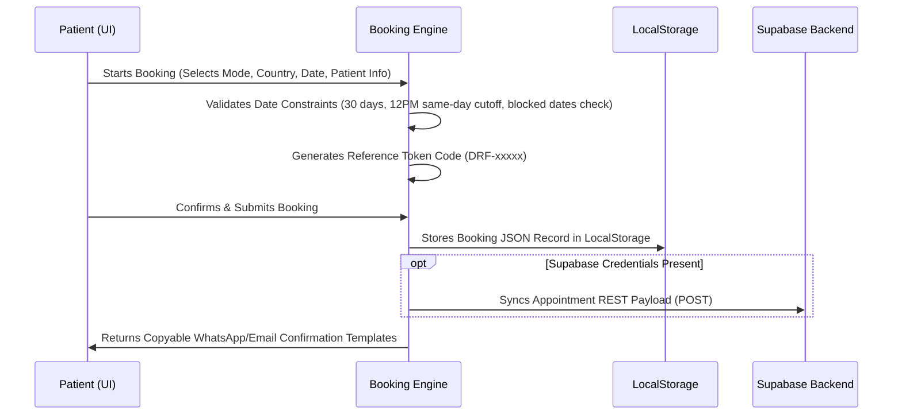
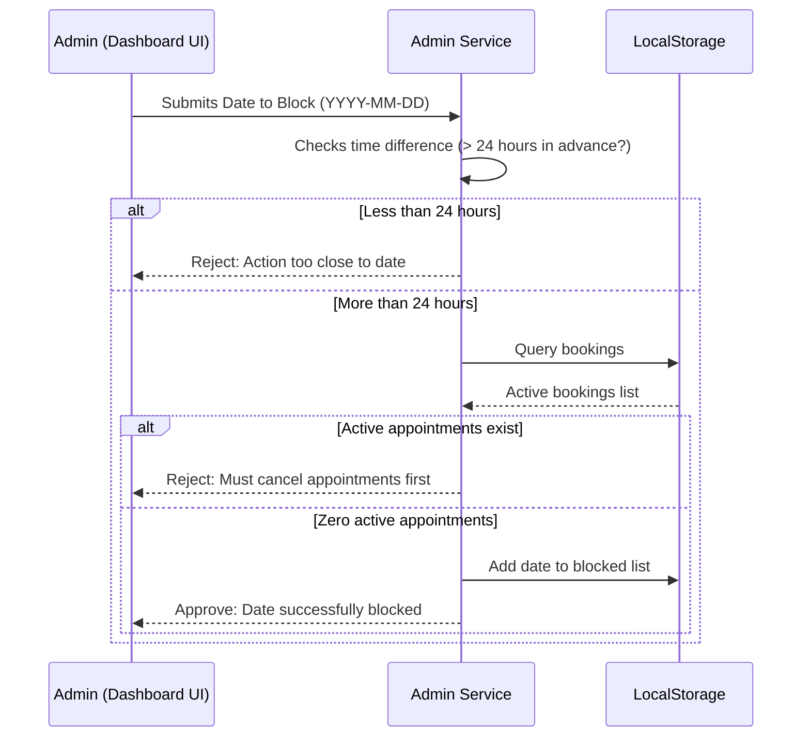

# Project Deep-Dive Analysis: Dr. Fahad Ul Zain Portfolio & Booking App

A comprehensive review of the architecture, key systems, tech stack, and logic behind the Consultant Psychiatrist portfolio website.

---

## 1. Project Overview & Architectural Summary
This application is a highly responsive, premium web portfolio and clinical utility suite for **Dr. Fahad Ul Zain**, a Consultant Psychiatrist. It serves a dual purpose:
1. **Public Portfolio & Education**: Showcases Dr. Fahad's medical background, research publications, clinic addresses/timings, clinical conditions treated, and a scientific mental wellness self-assessment tool.
2. **Booking Engine & Administration Portal**: Allows patients to register appointments in-person or online, while offering administrators a dashboard to manage bookings, user accounts, and calendar blockages.

### Tech Stack
*   **Core**: React 19 (`react` & `react-dom` version `^19.0.1`) and TypeScript (configured in `tsconfig.json`).
*   **Build Tool**: Vite 6 (`vite` version `^6.2.3`).
*   **CSS & Styling**: TailwindCSS v4 (`@tailwindcss/vite` version `^4.1.14`) and standard CSS for custom fonts.
*   **Animations**: Motion (`motion` version `^12.23.24`) for micro-interactions and transitions.
*   **Icons**: Lucide React (`lucide-react` version `^0.546.0`).

---

## 2. Codebase Structure
The codebase follows a clean, modular structure:

```
fahad-ul-zain/
├── .env.example              # Template for environment variables (Gemini API, App URL)
├── index.html                # Entry HTML document
├── package.json              # Project dependencies & script configurations
├── tsconfig.json             # TypeScript compiler settings
├── vite.config.ts            # Vite configuration with React and Tailwind v4 plugins
├── src/
│   ├── main.tsx              # Renders the App component in the DOM
│   ├── App.tsx               # Main container managing universal page layout & modals
│   ├── index.css             # Main stylesheet (fonts, Tailwind v4 theme, Urdu Nastaliq adjustments)
│   ├── data.ts               # Core static content (doctor info, conditions, FAQs, testimonials)
│   ├── translations.ts       # Global translation dictionary for English & Urdu translations
│   ├── types.ts              # Global TypeScript interfaces
│   ├── assets/               # Image/Icon assets
│   ├── components/           # UI Components
│   │   ├── AboutSection.tsx  # Doctor biography and credentials
│   │   ├── ClinicTimings.tsx # Branch details, schedules, map queries
│   │   ├── ConditionsSection.tsx # Psychiatric conditions overview
│   │   ├── ContactSection.tsx # Appointment call-to-actions
│   │   ├── FAQSection.tsx    # Accordion-style FAQs
│   │   ├── Footer.tsx        # Section navigation, copywrite details
│   │   ├── Header.tsx        # Navigation, logo, language toggles, admin portals
│   │   ├── Hero.tsx          # Introductory clinical landing section
│   │   ├── ResearchSection.tsx # Academic publications and Google Scholar linkages
│   │   ├── SelfAssessment.tsx # PHQ-9/GAD-7 standard diagnostic test
│   │   ├── ServicesSection.tsx # Specific treatments (evaluations, medicine calibration)
│   │   ├── Testimonials.tsx  # Patient success reviews
│   │   ├── TrustBar.tsx      # Core clinical values (ethics, confidentiality)
│   │   ├── admin/
│   │   │   └── AdminDashboardModal.tsx # Reports, user role changing, and blocked dates
│   │   ├── auth/
│   │   │   └── AuthModal.tsx # Sign-in/Sign-up for patient client and admin profiles
│   │   └── booking/
│   │       ├── BookingWizardModal.tsx # Public-facing 6-step multi-step booking modal
│   │       ├── Step1Mode.tsx          # Consultation type selection
│   │       ├── Step2Country.tsx       # Country and localized fee selection
│   │       ├── Step3DateSlot.tsx      # Date checking & slot selection
│   │       ├── Step4PatientInfo.tsx   # Name, phone, email, and reason details
│   │       ├── Step5Payment.tsx       # Simulated gateway selection
│   │       └── Step6Confirmation.tsx  # Generates Token, WhatsApp copy templates
│   ├── context/
│   │   ├── AuthContext.tsx   # Manages active sessions, role updates, and date blocks
│   │   └── LanguageContext.tsx # Context for translating lists, dynamic content, and page direction
│   ├── services/
│   │   ├── adminService.ts   # Checks/Updates blocked dates, handles cancellations
│   │   ├── authService.ts    # Manages user accounts, sessions, password encryption mockups
│   │   └── bookingEngine.ts  # Slot calculator, WhatsApp templates, Supabase API fallback
│   └── types/
│       ├── auth.ts           # Interfaces for users and block records
│       └── booking.ts        # Interfaces for slots, modes, countries, and steps
```

---

## 3. Core Capabilities & Mechanics

### A. Localization System (`LanguageContext` & `translations.ts`)
The app has a robust English/Urdu localization engine. 
*   **Dynamic UI Text**: Managed using the `t("key")` utility, mapping keys from `translations.ts`.
*   **Direction & Font Tweaks**: When switching to Urdu (`ur`), the layout is set to `dir="rtl"`.
*   **Nastaliq Typography**: Custom webfonts (e.g., *Jameel Noori Nastaleeq*, *Noto Nastaliq Urdu*) are loaded dynamically in `index.css`. Cursive script requires greater line height (`line-height: 2.1`) and larger font sizes to remain readable; the CSS includes responsive overrides for Urdu elements.

### B. Multi-Step Booking Engine (`bookingEngine.ts` & `Step1-6`)
A user-friendly, public-facing booking workflow that requires no login.
*   **Step 1 (Mode)**: Choice between In-Person (at Nawabshah/Hyderabad) or Online Video Consultation.
*   **Step 2 (Country & Fees)**: Selecting country (Pakistan, UK, USA, Gulf, etc.) updates currency, fee structures, and flags.
*   **Step 3 (Date & Time)**: Shows calendar availability. Dates can be selected up to 30 days in advance.
    *   *Cutoff Rule*: Same-day booking closes at 12:00 PM (Noon).
    *   *Schedule Constraints*: Nawabshah operates Mon-Fri (4:00 PM – 9:00 PM); Hyderabad operates Sun only (3:00 PM – 5:00 PM). Saturdays are closed.
*   **Step 4 (Patient Details)**: Captures patient information.
*   **Step 5 (Payment)**: Simulates JazzCash, Easypaisa, or Bank Transfers (locally) and PayPal/Stripe (internationally).
*   **Step 6 (Confirmation)**: Generates a unique token (e.g., `DRF-xxxxx`) and formats copyable message templates for WhatsApp coordination.

#### Supabase Integration
`bookingEngine.ts` contains a sync fallback: if `VITE_SUPABASE_URL` and `VITE_SUPABASE_ANON_KEY` are defined in the environment, bookings are synced directly to a remote Supabase PostgreSQL backend via standard `fetch` API headers. Otherwise, bookings fallback gracefully to client-side storage.

### C. Mental Wellness Self-Assessment (`SelfAssessment.tsx`)
This tool screens for mental health conditions using questions inspired by standard clinical tools (PHQ-9 and GAD-7):
*   Questions target anxiety, depression, sleep quality, and chronic burnout.
*   A cumulative score determines the wellness status:
    *   `0 – 3`: Minimal Psychological Stress (emerald indicator)
    *   `4 – 8`: Mild Emotional Turbulence (yellow indicator)
    *   `9+`: Moderate-to-High Diagnostic Distress (rose indicator)
*   Provides clinical advice and routes the user to book a consultation based on their score.

### D. Authentication & User Roles (`authService.ts`)
*   **Mock DB**: Emulates user registration and login by storing passwords and credentials in `localStorage` under `dr_fahad_registered_users` and `dr_fahad_user_passwords`.
*   **Super Admin Account**: A default administrator account is pre-seeded on startup:
    *   **Email**: `admin@drfahad.com`
    *   **Password**: `admin123`
*   **Role Constraints**:
    *   New users who register default to the `'client'` role.
    *   Only administrators can elevate client roles to `'admin'` using the `updateUserRole` service.

### E. Administrative Controls (`adminService.ts`)
Allows Dr. Fahad or clinical coordinators to manage bookings and schedule blocks:
*   **Date Blocking Rule**: Administrators can block dates on the calendar to stop patient bookings. However, a date can only be blocked if:
    1.  It is at least **24 hours in advance** of the target day.
    2.  There are **zero active (non-cancelled) bookings** on that date. Active appointments must be cancelled/rescheduled first.
*   **Printable Reports**: The dashboard has a print layout generator that formats and prints summaries of appointments, registered user records, and blocked dates.

---

## 4. Key Data Flows

### Booking Flow


### Date Blocking Flow (Admin Dashboard)

